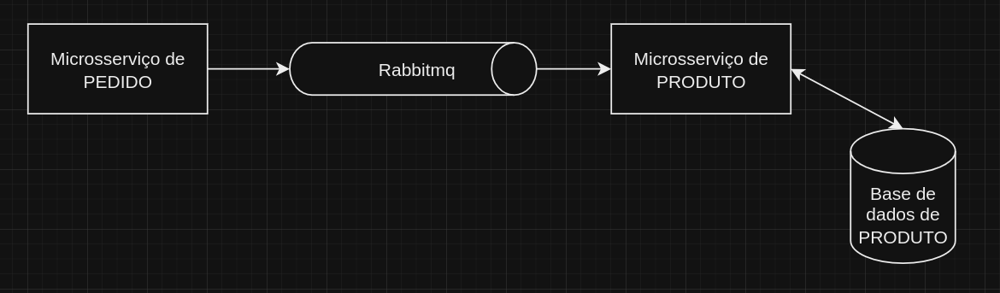
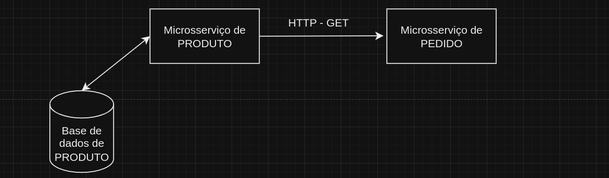

# FIAP-TechChallenge4-PRODUTOS

---

Quarto desafio da pós graduação da FIAP

---

Para executar o projeto junto com os outros microsserviços do desafio da FIAP-TechChallenge4,  na raiz do
projeto execute o docker-compose, pois ele provê a app e o banco de dados para se comunicar com os outros
microsserviços.

---

### Observações:

---

- Para executar os testes de `BDD`, a aplicação tem que estar rodando, juntamente com o banco de dados. Tem um docker-compose no diretório `docker-para-testes` na raiz do projeto, ele provê a app, o banco de dados.

- Para executar o teste de integração `ConsumerAtualizaEstoqueIT.java`, o rabbitmq tem que estar rodando. Tem um docker-compose no diretório `docker-para-testes` na raiz do projeto, ele provê o rabbimq.

###### O docker-compose localizado no diretório `docker-para-testes` na raiz do projeto, provê a app, o banco de dados, e o rabbimq. Portanto, pode subir esse docker-compose e executar os testes comentados acima.

- Caso queira subir somente o banco de dados, para execucar a app localmente, tem um docker-compose no diretório `docker-banco-de-dados`.

- Para rodar os testes de performance com Gatling, execute o seguinte comando: `mvn gatling:test`

---

### Integrações:

---

#### Que esse microsserviço utiliza:

- A aplicação consome mensagens do rabbitmq, para atualizar a quantidade dos produtos, seja pelo pedido ser realizado,
seja pelo pedido ser cancelado.

#### Que esse microsserviço fornece:

- A aplicação fornece via HTTP informações do produto, para o microsserviço de PEDIDO.

